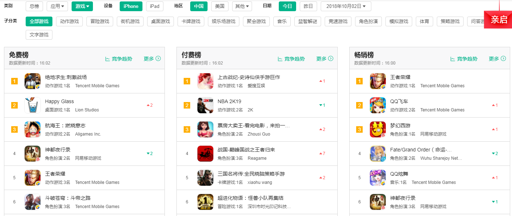
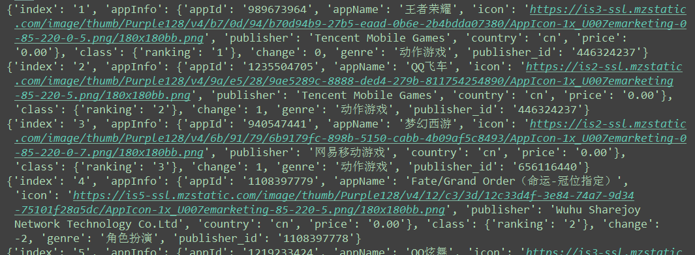

爬取七麦数据网APP榜单数据 
===========================
   
### 七麦数据网 - https://www.qimai.cn/rank 
|Author|:sunglasses:Henryhaohao:sunglasses:|
|---|---
|Email|:hearts:1073064953@qq.com:hearts:

      
****
## :dolphin:声明
### 七麦数据(原ASO100)是七麦科技推出的国内专业的移动应用数据分析平台，是国内同时打通App数据、微信公众号数据、小程序数据的数据分析平台。<br>
### 抱歉，软件仅用于学习交流，所以在此我并没有公开analysis参数解密文件(encrypt.js)。感谢大家！  

## :dolphin:介绍
### 该项目为爬取[七麦数据](https://www.qimai.cn/rank)平台APP榜单数据
- 爬虫文件:Spiders目录下的qimai.py
- JS解密文件:Spiders目录下的encrypt.js (抱歉，暂未公开！)
## :dolphin:运行环境
Version: Python3
## :dolphin:安装依赖库
```
pip3 install -r requirements.txt
```
## :dolphin:**运行截图**
> - **查看APP榜单数据 - https://www.qimai.cn/rank**<br><br>


> - **运行截图**<br><br>

## :dolphin:**总结**
> **最后，如果你觉得这个项目不错或者对你有帮助，给个Star呗，也算是对我学习路上的一种鼓励！<br>
 哈哈哈，感谢大家！笔芯~**:cupid::cupid:


